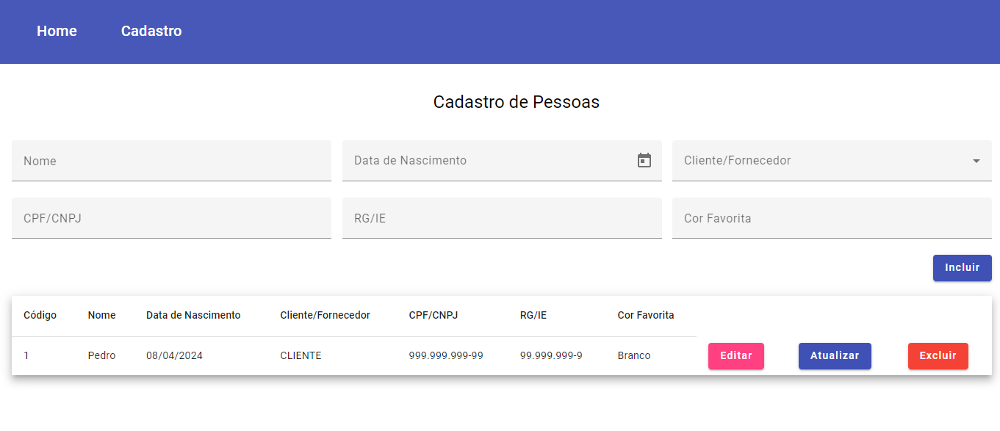

<h1 align="center"> CRUD-ANGULAR </h1>

  <a href="#memo-licença">Licença</a>

  

 

  

## 🚀 Tecnologias

Esse projeto foi desenvolvido com as seguintes tecnologias:

- TypeScript / Angular
- HTML e CSS
- Git e Github

## 💻 Projeto

O CRUD - Angular (realizado para estudo), é um cadastro de pessoas desenvolvido para ser usado como formulário em sistemas.

## :memo: Licença

Esse projeto está sob a licença MIT.

